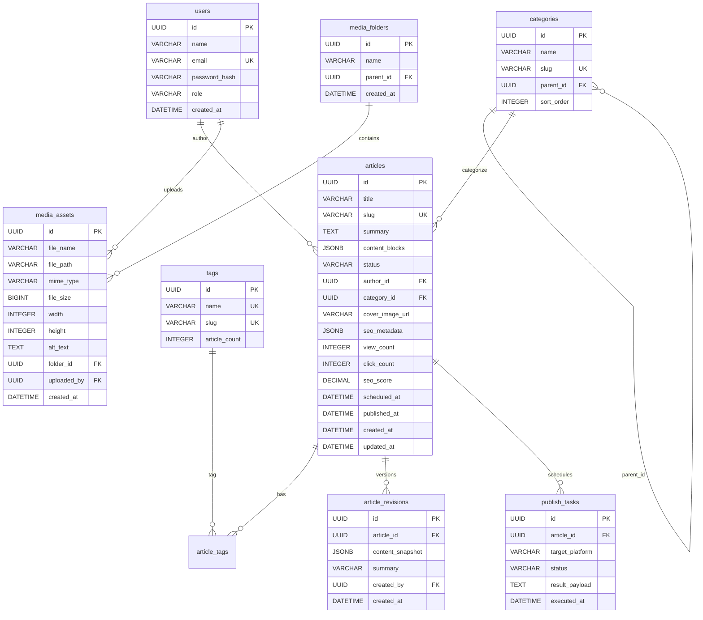
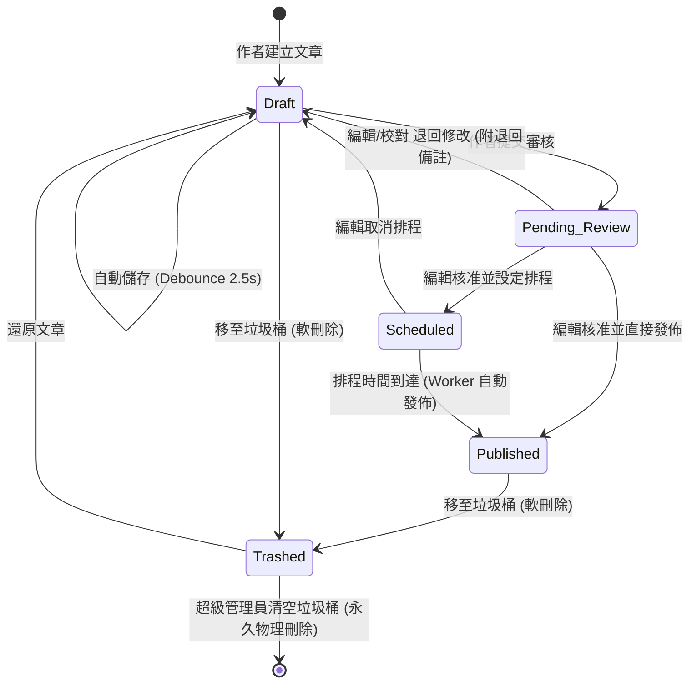
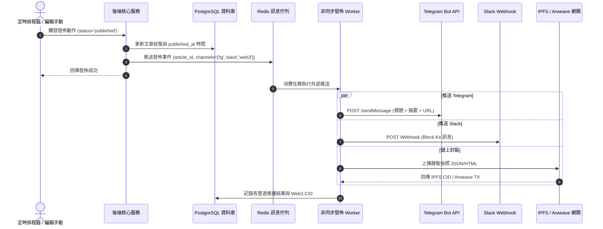

# 內容管理系統 (CMS) 功能規劃與技術規格書 (Specification Document)

- **文件版本**：v1.1.0
- **需求來源**：[prd.md](file:///Users/ycl/code/practice%202/prd.md)
- **文件狀態**：正式功能規格書 (Ready for Development)
- **建立日期**：2026-09-05

---

## 1. 功能概述／目標 (Overview & Objectives)

### 1.1 背景與欲解決之問題
傳統內容管理系統（CMS）常見以下痛點：
1. **發佈現狀掌握不易**：文章狀態模糊，缺乏多維度篩選、批量處置與即時 SEO 數據反饋。
2. **創作體驗割裂**：傳統富文本編輯器格式難以維護、容易遺失草稿、缺乏版本回溯與 AI 輔助生產力工具。
3. **媒體與多端同步繁瑣**：圖片上傳未經壓縮造成頻寬浪費、缺乏定時發佈排程、文章無法自動推送至 Telegram/Slack 或 Web3 存儲。
4. **權限混亂與組織鬆散**：缺乏嚴密的角色權限控制（RBAC），分類與標籤結構混亂。

### 1.2 系統目標
本系統旨在建構一套現代化、高效率且具備彈性擴展能力的**企業級內容管理與發佈平台**，達成以下核心目標：
- **高效全局管理**：提供狀態快照視圖、高響應度複合搜尋、批量操作與即時 SEO 表現監控。
- **無縫創作體驗**：以區塊式（Block-based）結構化內容為核心，提供 2.5 秒靜默自動儲存、版本歷史回滾與 LLM AI 創作輔助。
- **自動化發佈管線**：支援多格式媒體自動無損壓縮轉 WebP、精準至分鐘的排程發佈，以及社群（Telegram/Slack）與 Web3 去中心化（IPFS/Arweave）多端推送。
- **嚴謹架構與安全**：落地 4 級 RBAC 權限體系、集中化階層媒體庫與兩層級分類標籤管理。

---

## 2. 使用情境／使用者故事 (User Scenarios & User Stories)

### 2.1 系統角色定義
- **超級管理員 (Super Admin)**：掌控全站系統配置、RBAC 角色帳號指派、全站內容終極審查與永久刪除權限。
- **編輯 (Editor)**：負責內容品質把關、審核文章、排程發佈、跨平台推送、媒體資源管理與分類標籤維護。
- **作者 (Author)**：專注撰寫與創作內容、自定義 SEO 參數、調用 AI 輔助生成摘要與標籤、提交審核。
- **校對 (Proofreader)**：檢視草稿或待審核文章，針對錯別字、排版與法規合規進行批註與文字修改，無直接發佈權。

### 2.2 使用者故事 (User Stories)

| 編號 | 角色 | 情境 (When...) | 期望目標 (I want to...) | 價值 (So that...) |
| :--- | :--- | :--- | :--- | :--- |
| **US-01** | 編輯 / 管理員 | 在文章管理後台巡檢內容時 | 能快速透過狀態 Tab（草稿/待審/已發佈/排程）與分類、日期切換檢視 | 立即掌握網站各狀態文章分佈，減少搜尋時間。 |
| **US-02** | 編輯 | 需要下架多篇過期特賣促銷文章時 | 能在清單中多選文章並執行「批次移至垃圾桶」或「批次更改分類」 | 無需逐篇點入編輯，大幅提升運營效率。 |
| **US-03** | 作者 | 在創作萬字長篇專題報導時 | 系統能於編輯過程中背景即時自動保存，並記錄版本歷史 | 避免因瀏覽器崩潰或斷網遺失內容，並能隨時對比與回滾。 |
| **US-04** | 作者 / 編輯 | 撰寫完文章需要優化搜尋引擎成效時 | 透過 SEO 側邊欄即時檢視 OpenGraph 預覽，並由 AI 推薦高點擊標題與關鍵字 | 提升社群轉發吸引力與 Google 搜尋曝光率。 |
| **US-05** | 編輯 | 專案新聞需在明日清晨 06:00 正式公開時 | 設定排程時間，並勾選同步發送至官方 Telegram 頻道與 Slack 討論群 | 系統能在指定時間自動發佈並廣播，無需人員熬夜手動操作。 |
| **US-06** | 作者 | 在內文插入 5 張相機高解析度原始照片時 | 直接拖拽上傳，系統自動壓縮並轉為 WebP 格式並提示輸入 Alt Text | 確保文章網頁加載秒開，同時符合無障礙瀏覽規範。 |
| **US-07** | 超級管理員 | 團隊引進實習生與外包寫手時 | 設定其角色為「作者」，僅允許撰寫與提交本人草稿，禁止直接發佈或刪除他人文章 | 保障內容資產安全，落實分權審核流程。 |

---

## 3. 功能需求詳細規格 (Functional Requirements)

### 3.1 模組一：文章管理模組 (Article Management)

#### 3.1.1 狀態分流視圖 (Status Views)
- **FR-101**：系統必須提供快捷狀態切換分頁，包含：
  - `全部 (All)`：顯示所有未被移至垃圾桶的文章。
  - `草稿 (Draft)`：僅作者本人可見或編輯可審閱之未發佈文章。
  - `待審核 (Pending Review)`：作者已完成撰寫並提交，等待編輯/管理員覆核的文章。
  - `已發佈 (Published)`：正式對外公開顯示的文章。
  - `排程中 (Scheduled)`：等待排程時間觸發發佈的文章。
  - `垃圾桶 (Trash)`：已軟刪除之文章（保留 30 天，可還原或由超級管理員永久清空）。
- **FR-102**：每個狀態分頁標籤旁需直觀顯示當前符合該條件的文章計數徽章（Badge Counter）。

#### 3.1.2 多維度篩選與搜尋 (Search & Filter)
- **FR-103**：支援複合組合條件查詢，所有條件以 `AND` 邏輯交集檢索：
  - **標題關鍵字**：支援模糊搜尋（前後包含匹配），不分大小寫。
  - **作者篩選**：下拉選單單選或多選指定作者。
  - **分類篩選**：支援以樹狀階層選擇主分類或子分類。
  - **標籤篩選**：下拉標籤多選。
  - **日期區間**：可指定「建立日期」或「發佈日期」，以開始日期至結束日期進行過濾。
- **FR-104**：篩選條件需與瀏覽器 URL Query String 雙向同步（例如 `?status=published&category_id=xxx`），支援刷新頁面保留搜尋條件。

#### 3.1.3 批量操作工具 (Batch Operations)
- **FR-105**：列表表頭提供全選／取消全選 Checkbox；當勾選 1 篇以上文章時，上方浮現批量操作工具列：
  - **批次發佈 (Batch Publish)**：僅編輯與超級管理員可用。
  - **批次修改分類 (Batch Change Category)**：彈出分類選擇視窗，更新所有選中文章的分類。
  - **批次移至垃圾桶 (Batch Trash)**：彈出二次確認對話框，確認後軟刪除。
- **FR-106**：批量操作必須採用資料庫交易機制，若其中部分因權限不足失敗，需回傳明確之成功與失敗清單。

#### 3.1.4 SEO 指標快照與效能概覽
- **FR-107**：文章列表需直觀呈現該文章之量化指標：
  - **閱讀數 (PV)**：累計點閱瀏覽次數。
  - **點擊率 (CTR)**：外鏈/推播導流點擊成效百分比。
  - **SEO 健康度徽章**：根據系統演算評分顯示綠（80-100 優秀）、黃（60-79 待改善）、紅（<60 差）。點擊可展開優化建議彈窗。

#### 3.1.5 自定義列顯示 (Custom Column Visibility)
- **FR-108**：列表右上角提供「自定義欄位」按鈕，允許使用者勾選顯示或隱藏特定欄位：
  - 可控欄位包含：封面縮圖、作者、分類、標籤、字符數、閱讀數 (PV)、SEO 分數、建立時間、更新時間。
- **FR-109**：自定義欄位設定需持久化記錄於瀏覽器 `localStorage`，重新整理頁面後維持個人化排版。

---

### 3.2 模組二：內容創作模組 (Editor & Creation)

#### 3.2.1 區塊式編輯器 (Block-based Editor)
- **FR-201**：編輯器核心採用結構化區塊架構，支援區塊向上／向下拖拽重排、複製、刪除與型態切換。
- **FR-202**：必須支援以下區塊類型：
  - **標題區塊 (Header)**：H1、H2、H3、H4 級別。
  - **段落區塊 (Paragraph)**：富文本行內樣式（粗體、斜體、底線、刪除線、行內程式碼、超連結）。
  - **清單區塊 (List)**：有序清單、無序清單、核取清單 (Task List)。
  - **引言區塊 (Quote)**：支援引文文字與引述來源作者。
  - **程式碼區塊 (Code)**：語法高亮、語言指定與一鍵複製。
  - **多媒體區塊 (Media)**：單圖、多圖圖集、影片嵌入（YouTube、Vimeo）、社群貼文嵌入（X/Twitter、Instagram）。
- **FR-203**：支援 Markdown 語法快捷輸入（例如輸入 `# ` 自動轉為 H1，`- ` 自動轉為無序清單）。

#### 3.2.2 即時自動儲存與版本歷史 (Autosave & Revision History)
- **FR-204**：**靜默自動儲存**：使用者停止輸入 2.5 秒後（Debounce），前端自動向後端發送 Patch 請求儲存草稿，右上方顯示「已於 14:32 自動儲存」之綠色文字提示。
- **FR-205**：**修訂版本節點 (Revisions)**：
  - 每持續編輯 5 分鐘且有實質變更時，系統自動生成一個修訂節點。
  - 使用者手動點擊「儲存版本」或變更狀態時，生成命名版本。
  - 系統支援「版本歷史側邊欄」，點擊歷史節點可檢視當時內容快照、比對差異（Diff），並支援一鍵回滾（Rollback）。

#### 3.2.3 SEO 側邊欄配置與即時預覽
- **FR-206**：編輯頁右側提供獨立 SEO 配置面板：
  - **自定義 URL Slug**：系統根據標題自動生成英文拼音/拼寫別名，支援手動修改；即時驗證唯一性。
  - **Meta Title**：自定義標題（建議長度 30~60 字元，超標即時黃字警示）。
  - **Meta Description**：自定義描述（建議長度 120~160 字元，含即時字數計數器）。
  - **Open Graph 預覽**：提供「Facebook 分享預覽卡片」與「Line/Twitter 預覽卡片」切換檢視。

#### 3.2.4 AI 協作輔助引擎 (LLM Integration)
- **FR-207**：編輯介面整合「AI 智慧助手」懸浮工具列，提供以下能力：
  - **標題發想**：基於內文核心思想，生成 3~5 個兼具吸睛度與 SEO 權重的標題候選。
  - **自動摘要**：一鍵提煉內文精髓，自動填入 150 字內的文章 Summary 與 Meta Description。
  - **標籤與關鍵字擷取**：分析全文詞頻與主題，自動推薦 5 個高關聯度標籤，點擊可直接加入文章標籤中。

#### 3.2.5 媒體上傳與非同步壓縮轉檔
- **FR-208**：支援從本機桌面直接拖拽單張或多張圖片進編輯器，或由媒體庫中點選插入。
- **FR-209**：後端圖片處理管線：
  - 驗證二進位檔案型態，擋下可執行檔或偽裝副檔名。
  - 超過 2048px 寬度之大圖自動等比例縮放至最高 2048px。
  - 自動轉碼為現代 `WebP` 格式（壓縮率 85%），並生成 300x200 縮圖。
  - 上傳完成後自動將圖片 URL 替換入區塊資料中，並主動提示填寫 Alt Text。

#### 3.2.6 定時發佈與多端同步 (Scheduled & Multi-channel Publishing)
- **FR-210**：**定時發佈**：
  - 允許編輯設定未來的特定日期與時間（精確至分鐘），設定後文章狀態轉為 `scheduled`。
  - 排程服務每分鐘輪詢觸發，當前時間 `>= scheduled_at` 時，自動將狀態更新為 `published` 並公開。
- **FR-211**：**多端發佈推播**：在發佈選項中提供可勾選開關：
  - **Telegram 頻道**：自動呼叫 Telegram Bot API 推送文章標題、摘要、封面與閱讀連結。
  - **Slack 工作區**：向指定 Webhook URL 發布格式化卡片。
  - **Web3 去中心化存儲**：將 Markdown/HTML 靜態內容封裝上傳至 IPFS / Arweave，並於後台文章中回顯儲存 Hash/CID。

---

### 3.3 模組三：媒體庫與系統設置 (Media & Assets)

#### 3.3.1 媒體中心 (Media Gallery)
- **FR-301**：支援多媒體資源（圖片、影片、PDF 說明文件）集中式檢視與管理。
- **FR-302**：**資料夾層級分類**：支援建立與重新命名資料夾，允許跨資料夾拖拽移動檔案。
- **FR-303**：**圖片編輯工具**：
  - 內建輕量化圖片編輯模態框，支援旋轉（90°/180°）、比例裁切（16:9, 4:3, 1:1, 自訂）、縮放。
  - 支援線上直接編輯修改與保存 `alt_text`（替代文字），確保符合 Web 內容無障礙指南 (WCAG 2.1) 與 SEO 規範。

#### 3.3.2 角色型存取控制 (RBAC 權限控管)
- **FR-304**：系統強制區分 4 種角色，權限邊界如下表：

| 業務操作 | 超級管理員 | 編輯 (Editor) | 作者 (Author) | 校對 (Proofreader) |
| :--- | :---: | :---: | :---: | :---: |
| 建立新文章草稿 | ✅ | ✅ | ✅ | ❌ |
| 編輯本人文章 | ✅ | ✅ | ✅ | ❌ |
| 編輯他人文章 | ✅ | ✅ | ❌ | ✅ (提出修正) |
| 發佈文章 (含排程發佈) | ✅ | ✅ | ❌ (僅限提交審核) | ❌ |
| 移至垃圾桶 (軟刪除) | ✅ | ✅ | ❌ | ❌ |
| 永久刪除 / 清空垃圾桶 | ✅ | ❌ | ❌ | ❌ |
| 媒體庫上傳與編輯 | ✅ | ✅ | ✅ (僅本人資源) | ❌ (僅供預覽) |
| 分類與標籤增刪改 | ✅ | ✅ | ❌ (僅可選擇) | ❌ (僅可選擇) |
| 系統全站設定與帳號管理 | ✅ | ❌ | ❌ | ❌ |

#### 3.3.3 分類與標籤管理 (Categories & Tags)
- **FR-305**：**兩層級分類架構**：系統僅允許「主分類（Level 1）」與「子分類（Level 2）」兩層關係，嚴禁第三層，以維持內容導航簡潔。
- **FR-306**：**防呆與級聯規則**：
  - 若某主分類底下仍有子分類，禁止直接刪除主分類，需先清空或移動子分類。
  - 若分類底下已關聯文章，刪除分類時系統應提示將關聯文章批量遷移至另一指定分類或預設「未分類」。
- **FR-307**：**標籤雲管理**：支援標籤重複性檢測（防止拼寫差異重複新增），提供標籤合併功能，並顯示全站使用頻率熱度計數。

---

## 4. 資料模型 (Data Models)

### 4.1 實體綱要設計 (Entity Schema)



### 4.2 資料表詳細欄位定義

#### 1. 會員與權限表 (`users`)
| 欄位名稱 | 型別 | Nullable | 預設值 | 說明與約束 |
| :--- | :--- | :---: | :--- | :--- |
| `id` | `UUID` | 否 | `gen_random_uuid()` | 主鍵 |
| `name` | `VARCHAR(100)` | 否 | - | 使用者真實姓名或暱稱 |
| `email` | `VARCHAR(255)` | 否 | - | 電子信箱，`UNIQUE` 唯一約束 |
| `password_hash`| `VARCHAR(255)` | 否 | - | 加密密碼 (Argon2id 或 Bcrypt) |
| `role` | `VARCHAR(30)` | 否 | `'author'` | 角色：`super_admin`, `editor`, `author`, `proofreader` |
| `created_at` | `TIMESTAMP` | 否 | `CURRENT_TIMESTAMP` | 建立時間 |

#### 2. 文章主表 (`articles`)
| 欄位名稱 | 型別 | Nullable | 預設值 | 說明與約束 |
| :--- | :--- | :---: | :--- | :--- |
| `id` | `UUID` | 否 | `gen_random_uuid()` | 主鍵 |
| `title` | `VARCHAR(255)` | 否 | - | 文章標題 |
| `slug` | `VARCHAR(255)` | 否 | - | 唯一別名路徑，`UNIQUE`，建立 B-Tree 索引 |
| `summary` | `TEXT` | 是 | `NULL` | 文章簡述摘要 |
| `content_blocks`| `JSONB` | 否 | `'[]'` | 結構化區塊內容資料 |
| `status` | `VARCHAR(30)` | 否 | `'draft'` | 狀態：`draft`, `pending_review`, `published`, `scheduled`, `trashed` |
| `author_id` | `UUID` | 否 | - | 外鍵，參照 `users(id)`，`ON DELETE RESTRICT` |
| `category_id` | `UUID` | 是 | `NULL` | 外鍵，參照 `categories(id)`，`ON DELETE SET NULL` |
| `cover_image_url`| `VARCHAR(1024)`| 是| `NULL` | 封面圖完整 URL |
| `seo_metadata` | `JSONB` | 否 | `'{}'` | 包含 `meta_title`, `meta_desc`, `og_image` 等 |
| `view_count` | `INTEGER` | 否 | `0` | 閱讀瀏覽數 (PV) |
| `click_count`| `INTEGER` | 否 | `0` | 外導點閱數 |
| `seo_score` | `DECIMAL(5,2)` | 否 | `0.00` | 即時 SEO 評分 (0 ~ 100) |
| `scheduled_at` | `TIMESTAMP` | 是 | `NULL` | 預約排程發佈時間 |
| `published_at` | `TIMESTAMP` | 是 | `NULL` | 正式發佈時間戳記 |
| `created_at` | `TIMESTAMP` | 否 | `CURRENT_TIMESTAMP` | 建立時間 |
| `updated_at` | `TIMESTAMP` | 否 | `CURRENT_TIMESTAMP` | 最後更新時間 |

#### 3. 文章修訂歷史表 (`article_revisions`)
| 欄位名稱 | 型別 | Nullable | 預設值 | 說明與約束 |
| :--- | :--- | :---: | :--- | :--- |
| `id` | `UUID` | 否 | `gen_random_uuid()` | 主鍵 |
| `article_id` | `UUID` | 否 | - | 外鍵參照 `articles(id)`，`ON DELETE CASCADE` |
| `content_snapshot`| `JSONB` | 否 | - | 當時保存的完整區塊內容與 SEO 資料 |
| `summary` | `VARCHAR(255)` | 是 | `'自動儲存'` | 版本變更標記或備註 |
| `created_by` | `UUID` | 否 | - | 外鍵參照 `users(id)` |
| `created_at` | `TIMESTAMP` | 否 | `CURRENT_TIMESTAMP` | 快照生成時間 |

#### 4. 分類表 (`categories`)
| 欄位名稱 | 型別 | Nullable | 預設值 | 說明與約束 |
| :--- | :--- | :---: | :--- | :--- |
| `id` | `UUID` | 否 | `gen_random_uuid()` | 主鍵 |
| `name` | `VARCHAR(100)` | 否 | - | 分類顯示名稱 |
| `slug` | `VARCHAR(100)` | 否 | - | 唯一代稱，`UNIQUE` |
| `parent_id` | `UUID` | 是 | `NULL` | 父分類 ID，參照 `categories(id)`，`NULL` 為第一層主分類 |
| `sort_order` | `INTEGER` | 否 | `0` | 排序權重（由小至大排列） |

#### 5. 標籤與關聯表 (`tags`, `article_tags`)
- **`tags`**：`id (UUID, PK)`, `name (VARCHAR(50), UK)`, `slug (VARCHAR(50), UK)`, `created_at (TIMESTAMP)`。
- **`article_tags`**：`article_id (UUID, FK)`, `tag_id (UUID, FK)`，複合主鍵 `PRIMARY KEY (article_id, tag_id)`。

#### 6. 媒體庫與資料夾表 (`media_folders`, `media_assets`)
- **`media_folders`**：`id (UUID, PK)`, `name (VARCHAR(100))`, `parent_id (UUID, FK, Nullable)`, `created_at (TIMESTAMP)`。
- **`media_assets`**：`id (UUID, PK)`, `file_name (VARCHAR(255))`, `file_path (VARCHAR(1024))`, `mime_type (VARCHAR(100))`, `file_size (BIGINT)`, `width (INT)`, `height (INT)`, `alt_text (TEXT)`, `folder_id (UUID, FK, Nullable)`, `uploaded_by (UUID, FK)`, `created_at (TIMESTAMP)`。

---

## 5. 介面與 API 定義 (API Specifications)

全站採用 RESTful JSON 規範，全數端點均需攜帶 `Authorization: Bearer <JWT>` 權限標頭。

### 5.1 文章列表與篩選 API
- **Endpoint**: `GET /api/v1/articles`
- **說明**: 依據分頁、狀態、關鍵字、作者、分類、日期過濾文章。
- **Query Parameters**:
  - `page` (integer, default: 1): 當前頁碼
  - `limit` (integer, default: 20, max: 100): 每頁筆數
  - `status` (string, optional): `all`, `draft`, `pending_review`, `published`, `scheduled`, `trashed`
  - `keyword` (string, optional): 標題搜尋關鍵字
  - `category_id` (uuid, optional): 分類 ID
  - `author_id` (uuid, optional): 作者 ID
  - `date_type` (string, optional): `created` 或 `published`
  - `start_date` / `end_date` (ISO-8601, optional): 檢索日期範圍
- **Success Response (200 OK)**:
  ```json
  {
    "success": true,
    "data": {
      "items": [
        {
          "id": "c1f7b0a2-9b2f-4a6c-9c71-2e1c9d2f0001",
          "title": "2026 現代 Web 架構全攻略",
          "slug": "2026-modern-web-architecture",
          "status": "published",
          "author": { "id": "u1", "name": "Peace Maker" },
          "category": { "id": "cat1", "name": "軟體工程" },
          "view_count": 12850,
          "click_count": 920,
          "ctr": "7.16%",
          "seo_score": 92.5,
          "scheduled_at": null,
          "published_at": "2026-09-01T08:00:00Z",
          "updated_at": "2026-09-02T10:30:00Z"
        }
      ],
      "pagination": {
        "current_page": 1,
        "per_page": 20,
        "total_items": 142,
        "total_pages": 8
      },
      "status_counters": {
        "all": 142,
        "draft": 18,
        "pending_review": 5,
        "published": 112,
        "scheduled": 7,
        "trashed": 12
      }
    }
  }
  ```
- **Error Response**:
  - `400 Bad Request`: 日期格式無效或分頁參數非整數。
  - `401 Unauthorized`: 缺少 Token 或 Token 過期。

### 5.2 批量操作 API
- **Endpoint**: `POST /api/v1/articles/batch`
- **說明**: 批次變更狀態、分類或移至垃圾桶。
- **Request Body**:
  ```json
  {
    "action": "batch_publish", 
    "article_ids": [
      "c1f7b0a2-9b2f-4a6c-9c71-2e1c9d2f0001",
      "d2a8c1b3-8c3e-4b7d-8d82-3f2d0e3f0002"
    ],
    "target_category_id": null
  }
  ```
  *(支援 action: `batch_publish`, `batch_trash`, `batch_change_category`)*
- **Success Response (200 OK)**:
  ```json
  {
    "success": true,
    "message": "批量操作完成",
    "affected_count": 2,
    "failed_ids": []
  }
  ```
- **Error Response**:
  - `403 Forbidden`: 作者身分嘗試執行「批量發佈」。
  - `422 Unprocessable Entity`: 傳入的 `article_ids` 為空陣列或包含不存在的 ID。

### 5.3 編輯器自動儲存草稿 API
- **Endpoint**: `PATCH /api/v1/articles/:id/autosave`
- **說明**: 靜默即時保存編輯器草稿內容。
- **Request Body**:
  ```json
  {
    "title": "草稿標題更新",
    "content_blocks": [
      {
        "id": "blk_1",
        "type": "paragraph",
        "data": { "text": "正在輸入的新內文..." }
      }
    ],
    "seo_metadata": {
      "meta_title": "自訂SEO標題",
      "meta_description": "描述文字..."
    },
    "last_updated_at": "2026-09-05T14:00:00Z"
  }
  ```
- **Success Response (200 OK)**:
  ```json
  {
    "success": true,
    "updated_at": "2026-09-05T14:00:02.500Z",
    "revision_created": false
  }
  ```
- **Error Response**:
  - `409 Conflict`: 偵測到並行修改衝突（`last_updated_at` 落後於資料庫最新版本）。

### 5.4 AI 協作輔助 API
- **Endpoint**: `POST /api/v1/ai/assist`
- **說明**: 呼叫大型語言模型生成標題、摘要或標籤。
- **Request Body**:
  ```json
  {
    "task": "generate_title",
    "content_text": "文章純文字全文或前言摘要內容...",
    "current_title": "原始暫定標題"
  }
  ```
  *(task 可為: `generate_title`, `generate_summary`, `extract_tags`)*
- **Success Response (200 OK)**:
  ```json
  {
    "success": true,
    "task": "generate_title",
    "results": [
      "2026 最新 Web 架構全景解析：從前端到雲端原生",
      "告別傳統 CMS！打造極速現代內容發佈系統的實戰指南",
      "為什麼現代開發者都該掌握區塊式結構化內容？"
    ]
  }
  ```
- **Error Response**:
  - `429 Too Many Requests`: 單位時間呼叫次數超過限額 (Rate Limit)。
  - `502 Bad Gateway`: 上游 AI 服務連線逾時。

### 5.5 媒體檔案上傳與轉檔 API
- **Endpoint**: `POST /api/v1/media/upload`
- **說明**: 支援單檔或多檔上傳，觸發轉碼管線。
- **Content-Type**: `multipart/form-data`
- **Form Data**:
  - `files`: 二進位檔案（支援 jpg, png, webp, gif, mp4, pdf）
  - `folder_id` (uuid, optional): 目標存放資料夾 ID
- **Success Response (201 Created)**:
  ```json
  {
    "success": true,
    "uploaded_assets": [
      {
        "id": "m91f0c2e-4b3a-4e8c-8f1d-9e0a1b2c3d4e",
        "file_name": "architecture-diagram.webp",
        "original_name": "architecture-diagram.png",
        "file_path": "/uploads/2026/09/architecture-diagram.webp",
        "url": "https://cdn.example.com/uploads/2026/09/architecture-diagram.webp",
        "thumbnail_url": "https://cdn.example.com/uploads/2026/09/thumb_architecture-diagram.webp",
        "mime_type": "image/webp",
        "file_size": 245120,
        "width": 1920,
        "height": 1080,
        "alt_text": ""
      }
    ]
  }
  ```
- **Error Response**:
  - `413 Payload Too Large`: 單檔超過 20MB（影片超過 500MB）。
  - `415 Unsupported Media Type`: 檔案格式不符合白名單或 Magic Byte 檢驗失敗。

---

## 6. 業務流程與邊界條件 (Workflows & Edge Cases)

### 6.1 核心業務流程圖

#### 6.1.1 內容創作、審核與發佈生命週期


#### 6.1.2 多端同步推播流程


### 6.2 邊界條件與例外處理 (Edge Cases & Exception Handling)

| 異常情境 (Edge Case) | 潛在衝擊 | 系統防禦與容錯處理機制 |
| :--- | :--- | :--- |
| **1. 斷網或客戶端斷線** | 作者輸入的大量文字未儲存至後端 | 前端啟動 `IndexedDB` 本地備份機制。每 1 秒在本地快取編輯草稿；連線恢復時主動提示「偵測到本機有較新的未上傳草稿，是否同步還原？」。 |
| **2. 兩人同時編輯同一文章** | 後儲存者覆蓋先儲存者的修改內容 (覆寫衝突) | 採用**樂觀並行鎖 (OCC)**。儲存請求必須攜帶 `last_updated_at`；若後端發現版本落後，回傳 `409 Conflict`，前端彈出分割視窗顯示 Diff 差異對比，引導使用者手動合併。 |
| **3. 排程服務停機後重啟** | 停機期間已達排程時間的文章被遺漏 | 排程 Worker 啟動時必須執行「補償掃描（Catch-up Query）」：檢索所有 `status='scheduled' AND scheduled_at <= NOW()` 之文章，立即補跑發佈並記錄補發日誌。 |
| **4. 社群/Web3 推播失敗** | 第三方 API 故障或額度不足導致中斷 | 實施**指數退避重試 (Exponential Backoff)**（重試 3 次，間隔 5s, 15s, 60s）。若仍失敗，寫入死信佇列 (DLQ)，文章本體保持已發佈狀態，僅在後台標記「Telegram 推播失敗，可手動重試」。 |
| **5. 刪除含有子分類的主分類** | 造成子分類與關聯文章變為孤兒資料 | 資料庫層嚴格限制 `ON DELETE RESTRICT`。後端 API 檢核若發現存在子分類，阻斷刪除並回傳 `400 Bad Request`（需先手動遷移或刪除所有子分類）。 |
| **6. 偽造惡意檔案上傳** | 上傳偽裝成 .jpg 的可執行腳本進行遠端攻擊 | 1. 嚴禁直接將使用者原檔名作為儲存路徑，一律隨機重命名。<br>2. 透過 Sharp 讀取解析圖片 Magic Byte 二進位特徵，解析失敗一律拒絕。<br>3. 重新編碼為 WebP，徹底銷毀可能夾帶於 EXIF 的惡意 Shellcode。 |
| **7. 區塊式內容 XSS 攻擊** | 攻擊者在文章 JSON 中注入惡意 `<script>` | 渲染 HTML 之前，前端與 SSR 服務端必須強制通過 `DOMPurify` 白名單消毒，徹底剝除未授權標籤與 `javascript:` 偽協定。 |

---

## 7. 驗收標準 (Acceptance Criteria)

### 7.1 文章管理模組驗收要點
- [ ] **AC-101**：在狀態列切換「全部」、「草稿」、「待審核」、「已發佈」、「排程中」時，列表資料需在 300ms 內即時更新，且上方計數徽章需與資料庫實際筆數相符。
- [ ] **AC-102**：輸入關鍵字「Web」、作者選擇「Peace Maker」、分類選擇「軟體工程」並指定日期範圍，查詢結果必須同時滿足所有交集條件。
- [ ] **AC-103**：多選 3 篇文章執行「批次移至垃圾桶」，文章狀態應即時變為 `trashed`，並自原有分頁列表中移除。
- [ ] **AC-104**：列表中的 SEO 評分需依據真實指標運算，滑鼠 Hover 需能檢視「標題長度」、「內文字數」、「圖片Alt文字」等扣分細項。
- [ ] **AC-105**：在自定義欄位中取消勾選「封面圖」，重新整理頁面後，封面圖欄位依然保持隱藏狀態。

### 7.2 內容創作模組驗收要點
- [ ] **AC-201**：編輯器能順暢輸入 Markdown 快捷語法，能隨意拖拽更換區塊順序，插入 YouTube 影片連結後能即時預覽播放器。
- [ ] **AC-202**：在鍵盤停止輸入 2.5 秒後，右上方需顯示儲存成功提示；重新整理瀏覽器後內容不丟失。
- [ ] **AC-203**：點擊版本歷史可看到包含時間與修改者的修訂紀錄，點選其中任一歷史版本，能精確還原該版本內容。
- [ ] **AC-204**：在 SEO 面板輸入 Slug、Meta Title 與 Description，即時預覽區需即時呈現符合 Facebook / Line 規範的卡片外觀。
- [ ] **AC-205**：點擊「AI 標題推薦」，系統需在 3 秒內呼叫 LLM 輸出 3~5 組候選標題，點擊即可直接替換至文章標題。
- [ ] **AC-206**：拖拽一張 10MB 的 PNG 大圖至編輯器，後端能自動壓縮並轉為 WebP（檔案大小降至 1MB 以下）且成功回顯於編輯區。
- [ ] **AC-207**：設定文章在 2 分鐘後排程發佈，2 分鐘後重新整理頁面，文章狀態應自動轉換為 `published`。

### 7.3 媒體庫與系統設置驗收要點
- [ ] **AC-301**：媒體庫中可新增「2026專案活動」資料夾，將照片拖入該資料夾後，路徑與分類關係正確更新。
- [ ] **AC-302**：在媒體庫中點選裁切工具將 4:3 圖片裁切為 1:1，儲存後能生成新規格圖片，且 Alt Text 欄位變更能成功保存。
- [ ] **AC-303**：以「作者 (Author)」身分登入，嘗試呼叫發佈 API 或刪除他人文章，系統必須回傳 `403 Forbidden` 並拒絕操作。
- [ ] **AC-304**：建立一個第二層子分類時，若試圖將其設為第三層，介面與後端應直接限制並報錯；刪除尚有子分類之主分類時需被安全攔截。

---

## 8. 技術棧與系統限制 (Tech Stack & Constraints)

### 8.1 建議技術實現清單
| 架構層級 | 建議採用技術 | 選型考量 |
| :--- | :--- | :--- |
| **前端應用** | Next.js 15 (App Router) + React 19 + TypeScript | 具備伺服器端渲染 (SSR) 與最佳 SEO 效能 |
| **樣式與 UI 庫** | Tailwind CSS + Radix UI (Shadcn/UI) + Lucide Icons | 現代簡約、無障礙支援良好且高度可定制 |
| **編輯器核心** | Tiptap (基於 ProseMirror) 或 Editor.js | 現代標準的 Block-based 結構化輸出 |
| **後端框架** | Node.js (NestJS / Fastify) 或 Python (FastAPI) | 高吞吐量、原生支援非同步任務 |
| **資料庫** | PostgreSQL 16 (含 JSONB 索引) 或 SQLite 3 (輕量部署) | 高可靠性、支援強大全文檢索與結構化 JSON 查詢 |
| **快取與佇列** | Redis 7 + BullMQ | 處理定時排程、圖片轉換佇列與限流 |
| **影像轉檔** | Sharp (libvips C-binding) | 目前 Node.js 生態圈速度最快且記憶體佔用極低之圖片處理庫 |
| **AI 整合** | Google Gemini API (Interactions API) / OpenAI GPT-4o-mini | 高語義理解度、回應延遲低、成本經濟 |
| **去中心化存儲**| Pinata (IPFS) / Irys (Arweave SDK) | 標準 Web3 內容永存解決方案 |

### 8.2 系統邊界與容量限制 (System Constraints & Limits)
1. **媒體單檔大小限制**：
   - 圖片（JPG, PNG, WebP, GIF）：最大 `20 MB`。
   - 影片（MP4, WebM）：最大 `500 MB`。
   - 檔案附件（PDF）：最大 `50 MB`。
2. **文字長度限制**：
   - 文章標題：最高 `255` 字元。
   - Meta Description：最高 `300` 字元。
   - 內文總容量：單篇文章 `content_blocks` JSON 限制最大 `5 MB`。
3. **並行與效能約束 (SLA)**：
   - API 唯讀查詢（文章列表、單篇檢視）95% 請求應在 `150ms` 內完成。
   - 自動儲存 Patch 請求應在 `100ms` 內完成響應。
   - 支援系統在並行 500 名編輯同時寫入時不發生鎖表逾時。
4. **瀏覽器相容性標準**：
   - 支援 Chrome 100+、Safari 16+、Firefox 100+、Edge 100+。不支援任何版本的 Internet Explorer。
